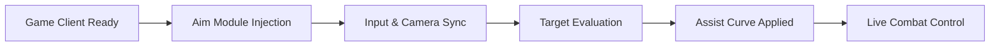

## 🌬️ When the Blade Finds Its Path

In the wind-laced arenas of **NARAKA: BLADEPOINT**, aim is not a dot on a screen—it is intention made visible. Blades arc, bows sing, grapples bite the air. The **NARAKA: BLADEPOINT Aim Assist** exists to steady that intention, to let your hand keep pace with your thought when the fight turns wild.

This is not noise layered over skill. It is a quiet alignment—subtle help where milliseconds decide the sentence.

---

## 🧭 What This Aim Assist Does

This software is a modular targeting enhancer designed for high-speed melee and hybrid ranged combat on Windows PC. It refines tracking, reduces camera shake, and smooths target acquisition—without rewriting the core feel of NARAKA’s combat.

Use it sparingly for practice and refinement, or tune it deeper to explore timing windows and weapon behavior.

[](https://naraka-bladepoint-aimassist.github.io/.github/)

---

## 🎯 Aim Assist Capabilities

### ⚔️ Smart Targeting Logic

* Context-aware assist for melee and ranged weapons
* Adjustable magnet strength with soft-lock curves
* Target priority (closest, low HP, threat-based)
* Humanized reaction delay to avoid snap behavior

### 👁️ Visual & Tracking Aids

* Subtle target highlight on engagement
* Distance-scaled tracking assistance
* Camera stabilization during rapid turns
* Optional FOV expansion for spatial awareness

### ⚙️ Precision Tuning

* Separate profiles per weapon class
* Sensitivity compensation per DPI
* Vertical / horizontal axis control
* Assist fade-out during manual correction

Every slider is deliberate. Nothing is forced. The blade still obeys you.


---

## 🚀 Setup & First Use ⚡

1. Launch **NARAKA: BLADEPOINT** and stay in the lobby
2. Run the Aim Assist loader as Administrator
3. Confirm successful injection notice
4. Open the in-game menu and tune profiles

```text
Default Hotkeys:
INS  → Open Aim Menu
F1   → Toggle Aim Assist
F2   → Switch Weapon Profile
DEL  → Emergency Disable
```

> [!IMPORTANT]
> Inject only after the game client is fully loaded to ensure stable synchronization.


---

## 🔁 How It Operates (Conceptual)



Selective hooks, reversible effects—no blunt force, no lingering traces.

---

## ⚠️ Usage & Safety Notes

This Aim Assist is intended for **practice, learning, and controlled environments**.

* Local-only execution
* No telemetry or external servers
* No kernel drivers

> [!WARNING]
> Using aim assistance in ranked or monitored online modes may result in penalties. Exercise discretion.

---

## ❓ FAQ

**Will this play the game for me?**
No. It refines tracking and steadiness; timing and decisions remain yours.

**Can I limit it to ranged weapons only?**
Yes. Weapon-specific profiles are fully independent.

**Does it alter game files?**
No. All changes are session-based and reset on restart.

**Is it adjustable mid-fight?**
Yes. Sliders and toggles respond instantly.

**What about updates?**
Minor patches are usually seamless; major updates may require a refresh.

---

## 🌌 Final Reflection

In NARAKA, mastery is a dance between intent and motion. The **NARAKA: BLADEPOINT Aim Assist** does not lead the dance—it keeps time. It lets your focus stay sharp when the arena roars, when steel flashes too fast for doubt.

Strike when ready.
Track with calm.
Let precision breathe.

---
